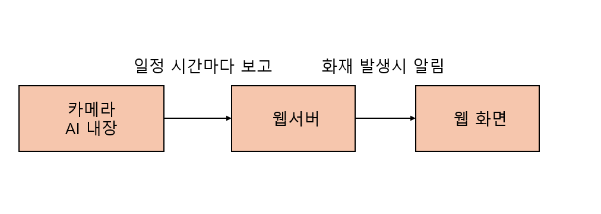

# AI-Makerthon 팀 프로젝트 소개
 


## 목차
- [팀 소개](#팀-소개)
- [프로젝트 개발 이유](#프로젝트-개발-이유)
- [프로젝트 개요](#프로젝트-개요)
- [실행 방법](#실행-방법)
- [학습 방법](#인공지능-학습-방법)
- [설치 위치](#설치-위치)
- [기대 효과](#기대-효과)
- [개선할 점](#개선할-점)
- [문의](#문의)

---

## 팀 소개

### 팀 이름: **오리**

| 이름  | 역할    | GitHub Profile                                         |
|-----|-------|--------------------------------------------------------|
| 채율  | 팀장    | [@chae03yb](https://github.com/chae03yb)               |
| 허건회 | 인공지능  | [@gjrjsghl](https://github.com/gjrjsghl)               |
| 염수빈 | 프론트엔드 | [@Rulrudino0911](https://github.com/Rulrudino0911)     |
| 이건영 | 엔지니어  | [@CheonanTechKing](https://github.com/CheonanTechKing) |

---

## 프로젝트 개발 이유

### 주요 동기:
매년 발생하는 산불로 잃게되는 산림 생태계와 재산들을 보호하기 위하여 이 프로젝트를 기획하게 되었습니다.
1. **문제 정의**: 주기적으로 발생하는 대형 산불로 많은 피해를 입는다
2. **해결 목표**: 산불로 발생하는 피해를 줄이자
3. **핵심 가치**: "안전" 그리고 "생태계"
                   

---

## 프로젝트 개요

### 프로젝트 이름: **산불조기감지알림시스템**

### 주요 기능:



- ~~라즈베리파이~~ 웹캠 카메라를 이용해 이미지 인식
- 이미지 인식을 통한 AI의 산불 조기 자동 탐지
- 산불 발생 위치를 지도에 표시
- 데이터베이스를 통한 기기 위치 관리

### 기술 스택:
- 인공지능: `OpenCV, TensorFlow`
- 백엔드: `Flask, SQLite`
- 프론트엔드: `HTML`
- 카메라 : ~~라즈베리파이~~`웹캠`
---

## 인공지능 학습 방법
  에서 데이터셋을 가져온 후, 해당 작성자의 코드를 참고하여 학습
 
   [모델 파일](image-detection/model/final_model.h5)

## 실행 방법

### 1. 환경 설정
1. **프로젝트 클론**
   ```bash
   git clone https://github.com/chae03yb/hstree-makerthon.git mandarin-in-snacks
   cd mandarin-in-snacks
   ```

2. **필요한 패키지 설치**
   ```bash
   python3 setup.py
   ```

### 2. 실행
1. **개발 서버 실행**
   ```bash
   cd webserver
   python3 main.py
   ```

### 3. 접속
   - 로컬에서: `http://localhost:8720`

---

## 설치 위치


-산림청
1. 대부분의 산불 원인은 사람
2. 따라서 등산로 주변 위주로 설치

---

## 기대 효과
1. **산불 초기 대응 시간 단축**
   
   설치된 기계가 산불을 인지하면 웹사이트에서 빠르게 화재를 확인 할 수 있으므로 산불 발생 초기 단계에서 신속하게 대응할 수 있음

   
3. **산불 발생 위치의 정확한 파악**

   화재가 난 기계의 위치 좌표를 확인 할 수 있어 산불 발생 위치를 정확히 파악할 수 있음
   현장 대응팀이 효과적으로 화재 지점에 접근하여 신혹하게 조치를 취할 수 있음


5. **인명 및 재산 피해 감소**

   산불이 초기 단계에서 진화되면 산불 확산으로 인한 인명 및 재산 피해를 크게 줄일 수 있음
   산림 생태계 훼손을 최소화하고, 산불로 인한 대기오염 또한 감소시킬 수 있음


7. **산림 관리 효율성 증대**

   웹사이트를 통해 산림 상태를 지속적으로 점검할 수 있어 사람이 직접 산림을 순찰하는 방식에 비해 효율적이고 정확하게 관리할 수 있음
   관리 인력 및 운영 비용 절감 효과 또한 기대할 수 있음


9. **데이터 활용 가능성**

   축적된 산림 데이터를 분석하여 산불 발생 패턴, 주요 원인, 고위험 지역 등을 파악할 수 있음
   이를 통해 향후 산불 예방 정책 및 대응 계획을 더 효과적으로 수립할 수 있음

---

## 개선할 점
1. GPS

   지금은 위치가 고정값으로 되어있지만, 차후에는 GPS를 통한 위치로 변경


---

## 문의

프로젝트에 대한 문의 사항은 아래로 연락해주세요:

- **이메일**: chae_yb@kakao.com
- **GitHub Issues**: [링크](https://github.com/chae03yb/hstree-makerthon/issues)

---

감사합니다! 🙌
